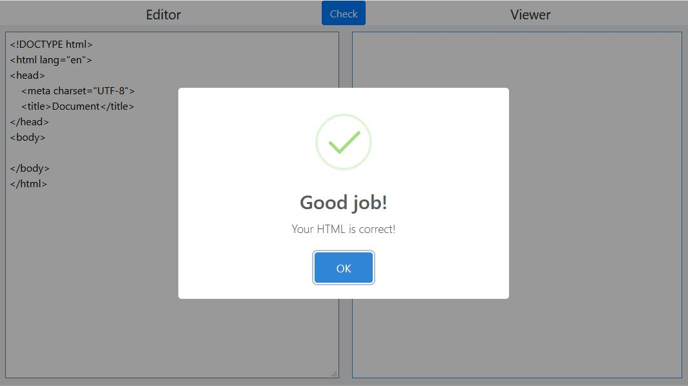

# HTML Basic

2018-11-20 HTML第一次上課

[HTML Basic(課中簡報)](https://hackmd.io/p/BJh5ZWVoW#/)

## HTML基本語法

```html
<標籤 屬性="值">內容</標籤>
```

- 標籤
    - 在HTML5標準中定義的網頁元素
    - 標籤為英文，沒規範大小寫，```<a>```及```<A>```視為等價，但請以通用寫法為主(小寫英文)
- 屬性
    - 描述這個標籤的內部資訊
    - 有些標籤會有屬於自己專屬的屬性，輸入未定義的屬性不會產生錯誤
    - 常用屬性為 ```class```及```id```，日後說明
    - 通用寫法為英文小寫
- 值
    - 描述該屬性的值
    - 值為字串
    - 用引號包圍表示，單引號或雙引號都可以
- 內容
    - 描述該標籤的主體
    - 不同標籤對於內容會有不同呈現方式
    - 空白字元或特殊符號需要另外處理
    - 可以是任何語言文字，但要注意編碼

## 符合W3C標準的HTML文件

### 文件宣告 doctype

HTML的文件第一行，必須宣告此文件的形式及版本

HTML5

```html
<!DOCTYPE html>
```

### 語言標示 lang屬性

整個HTML文件，被```<HTML>```標籤包覆著，這個HTML標籤須加上lang的屬性

如
```html
<html lang="en">

</html>
```

根據文件所使用的語言，設定不同的lang值

- 英文 
    - ```en```
- 中文
    - ```zh-Hant-TW```

### 文件標題 title

這裡的title指的不是內容中的標題，而是整個HTML文件的title，通常這個title會出現在瀏覽器的頁籤上

title需要被定義在```<head>```中

```html
<!DOCTYPE html>
<html lang="en">
  <head>
    <title>My First HTML page</title>
  </head>
</html>
```

### 文件編碼 charset

字元有許多不同的編碼方式，如果撰寫文件時的編碼方式與解讀文件時的編碼方式不同，會讓人難以解讀，俗稱『亂碼』

在台灣常見的編碼方式為big5及utf-8

而HTML5通用的編碼方式為utf-8，所以這理要求大家

- 撰寫文件時，必須用utf-8的編碼去撰寫文件
- 撰寫的HTML文件中，必須要指定，該文件為utf-8編碼
- 使用```<meta>```標籤的 charset屬性，來指定字元編碼
- ```<meta>```標籤放在```<head>```中

```html
<meta charset="UTF-8">
```

### 主體 body

以上都僅僅在設定這份HTML文件的相關資訊，然而HTML的內容，需要寫在```<body>```標籤中，所以綜合起來基本的結構會長這樣

```html
<!DOCTYPE html>
<html lang="en">
<head>
    <meta charset="UTF-8">
    <title>Document</title>
</head>
<body>
    
</body>
</html>
```

這是最基本符合W3C規範的網頁，雖然看起來什麼內容都沒有，但是個好的開始。

各位可以把自己寫的HTML原始碼丟到 [Real-Time-HTML-Editor](https://yubintw.github.io/Real-Time-HTML-Editor/) 進行語法的檢查。注意這個只能檢查HTML及CSS的"語法"，並不能保證你寫的東西是你想要的。



### 基本要素

注意：未來繳交的作業及考試，必須至少符合上述的元素

- 宣告DOCTYPE
- 設定 ```lang``` 屬性
- 設定字元編碼為utf-8
- ```<html> <head> <title> <body>```標，撰寫、使用正確

可以善用 [Real-Time-HTML-Editor](https://yubintw.github.io/Real-Time-HTML-Editor/)的CHECK功能，檢查語法

## 常見標籤

### 標題 h1, h2, h3, h4, h5, h6

定義標題(headings)

```<h1>```代表最重要的標題，```<h6>```表示最不重要的標題

在主流瀏覽器中，```<h1>```預設顯示的字體大小最大，```<h2>```次之，依此類推

```html
<h1>This is heading 1</h1>
<h2>This is heading 2</h2>
<h3>This is heading 3</h3>
<h4>This is heading 4</h4>
<h5>This is heading 5</h5>
<h6>This is heading 6</h6> 
```

[headings tag reference]("https://www.w3schools.com/tags/tag_hn.asp")

### 段落 p

定義段落(paragraph)

```html
<p>
  人生短短幾個秋呀，不醉不罷休。東邊我的美人哪，西邊黃河流。來呀來個酒啊不醉不罷休，愁情煩事別放心頭。
</p>
```

[p tag reference](https://www.w3schools.com/tags/tag_p.asp)

### 超連結 a

定義超連結(hyperlink)，用以跳轉到某個目標資源

```html
<a href="https://www.facebook.com/catfatorange/" target="_blank">肥橘</a>
```

#### href屬性
定義該a標籤的跳轉目標，格式為URL

#### target屬性
定義從哪裡該起該目標連結

常用target值：
- ```_self```，預設值，在本頁面開啟連結
- ```_blank```，開新分頁，在該分頁開啟連結

[a tag reference](https://www.w3schools.com/tags/tag_a.asp)

### 圖片 img
定義圖片(image)

```html

```

#### src屬性
``````標籤最重要的屬性，必須能正確連結到要顯示的圖片資源，URL格式

#### alt屬性
替代文字，如果src屬性定義的目標資源無法正確拿到圖片，瀏覽器會顯示替代文字

- ``````標籤只有頭，沒有尾。不用寫```</img>```。
- arc屬性與alt屬性都要定義

```html

```

[img tag reference](https://www.w3schools.com/tags/tag_img.asp)