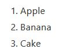

# 常見標籤介紹

- ```<ol>```
- ```<ul>```
- ```<iframe>```
- ```<div>```
- ```<span>```
- ```<!-- -->```

## ol 有序清單 ordered list

```<ol>```標籤定義有順序的清單，搭配```<li>```作為清單項目

```html
<ol>
  <li>Apple</li>
  <li>Banana</li>
  <li>Cake</li>
</ol>
```



### type 屬性

定義清單中的標誌類型

- 1
    - Default. Decimal numbers (1, 2, 3, 4)
- a
    - Alphabetically ordered list, lowercase (a, b, c, d)
- A
    - Alphabetically ordered list, uppercase (A, B, C, D)
- i
    - Roman numbers, lowercase (i, ii, iii, iv)
- I
    - Roman numbers, uppercase (I, II, III, IV)

```html
<ol type="i">
  <li>Apple</li>
  <li>Banana</li>
  <li>Cake</li>
</ol>
```

## ul 無序清單 unordered list

```<ul>```標籤定義有順序的清單，搭配```<il>```作為清單項目

```html
<ul>
  <li>Apple</li>
  <li>Banana</li>
  <li>Cake</li>
</ul>
```


## iframe

```<iframe>```標籤用來把其他文件內嵌在當前的HTML文件中

```html
<iframe src="https://www.nctu.edu.tw">
```

> 內嵌[YouTube](https://www.youtube.com/)影片也是運用```<iframe>```標籤

## div

```<div>```標籤用於將block元素群組起來，以便套用CSS樣式

```html
<div class="test">
  <h2>This is a heading</h2>
  <p>This is a paragraph.</p>
</div>
```

## span

```<span>```標籤用於將inline元素群組起來

```html
<p>Today is <span id="highlight">Tuesday</span>. I want to sleep.</p>
```

## <!-- --> 註解

註解的標籤用於在HTML原始碼中加入註解，

```html
<!-- 這是註解 -->

<!-- 
    可以
    多行註解
-->
```

- 註解不會被瀏覽器解讀
- 註解是寫給人看的
